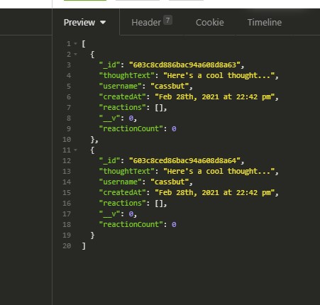

# E-commerce Back End Starter Code Challenge 

  ## Description
   An exercise to create a generic Social Network API using Express.js, MongoDB, and Mongoose.

   ```
AS A social media startup
I WANT an API for my social network that uses a NoSQL database
SO THAT my website can handle large amounts of unstructured data
```
## Criteria 
```
GIVEN a social network API
WHEN I enter the command to invoke the application
THEN my server is started and the Mongoose models are synced to the MongoDB database
WHEN I open API GET routes in Insomnia Core for users and thoughts
THEN the data for each of these routes is displayed in a formatted JSON
WHEN I test API POST, PUT, and DELETE routes in Insomnia Core
THEN I am able to successfully create, update, and delete users and thoughts in my database
WHEN I test API POST and DELETE routes in Insomnia Core
THEN I am able to successfully create and delete reactions to thoughts and add and remove friends to a user’s friend list
```
 ## 🖥️ Links 

Demo Video 1: https://drive.google.com/file/d/1OYhwdRxeZtQYtK461M-chYZOVq5DYu1t/view

Demo Video 2: https://drive.google.com/file/d/1bwkw-jp_eRLAu8GTh_es_B9QKO06YYsC/view <br>

  ## 💽 Installation
   Clone the code to your computer and open the root folder in the command line. Run the following to install the node dependencies
   ```
   npm install 
   ```
   
   After this, you can run the following in the command line to start the server

   ```
   node server.js
   ```

  ## ➕ Features
   Express.js MongoDB Mongoose

  ## 💾 Screenshots
  
  
  
  
  

   ## 🖥️ Links 
GitHub: https://github.com/clhurlbut/Social-Network-API <br>

  ## 💖 Credits
   Thank you to UCLA / Trilogy Bootcamp!

  ## 🙋 Questions 
   Please feel free to contact the developer with any questions/comments/concerns. 

   📧 **Email**
   <clhurlbut@gmail.com>

   🔗 **GitHub** 
   [clhurlbut](https://github.com/clhurlbut)


  This README was generated with 🥔 [readmeGenerator](https://github.com/clhurlbut/readmeGenerator)  